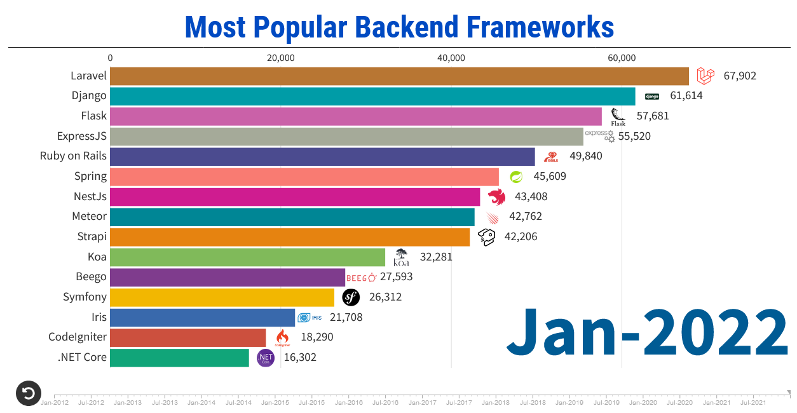

# Web Development Key notes

## Web dev architecture

* Web 2.0
* User authentication

* Backend
 * data consitency
 * User Permission CRUD
 * Security
 * Services
  * S3 (File Storage)
  * Yousign

* Protocol HTTP
* WS

### Backend Frameworks

  

### Frontend Frameworks

## NodeJS 

- JavaScript Runtime

- uses npm/yarn for package management

- Contains multiple backend frameworks

  * NestJS
  * ExpressJS
  * Koa

- Contains multiple frontend frameworks
  * ReactJS
  * Angular
  * Vue

- Typescript is a superset of JavaScript
  
  * typed language

  *  compiles to Javascript

  * help developers write clean & consistent code 
  
  * avoid runtime errors 

- Promise: async function container

## Databases

* Server side

* Relational vs NoSQL

  * MySQL
  * Postgres
  * MongoDB

* CRUD
  * Create
  * Read
  * Update
  * Delete

* nested associations

